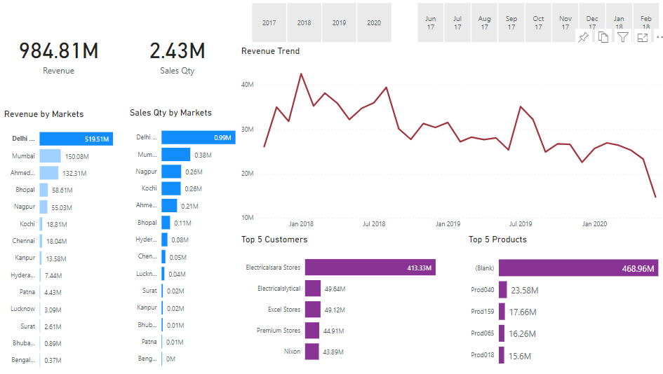
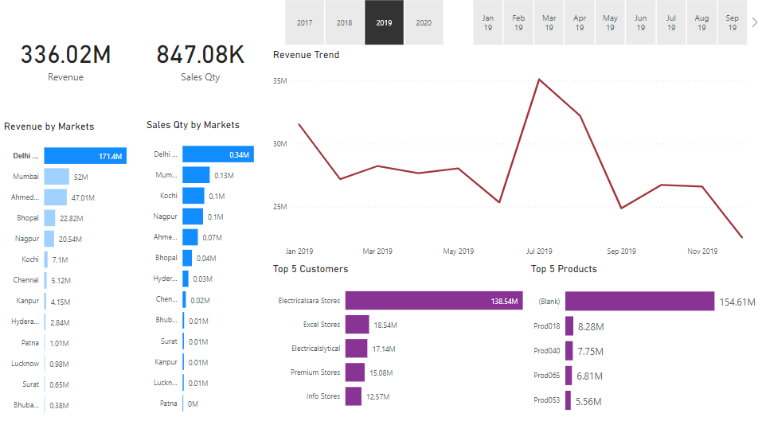
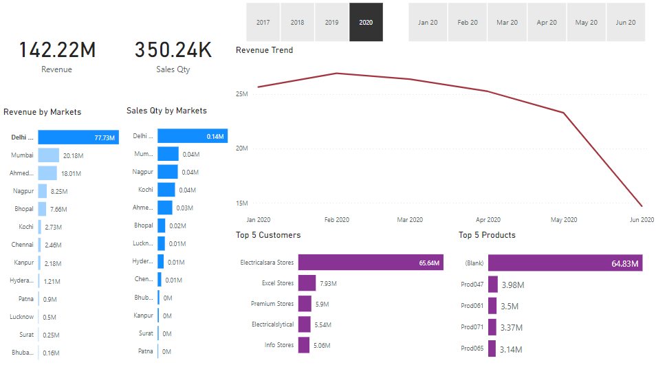

# <h1>ATLIQ-HARDWARE-SALES-INSIGHTS-DATA-ANALYSIS-AND-VISUALIZATION</h1>
<h5>Microsoft Power Bi, Mysql, Data Wrangling.</h5>

Mysql database has all sales transactions, customers, products and markets information.
I have analyse this database and than hook it up with power BI. In power BI I perform
ETL and data cleaning operations to make it ready so that we can build our dashboard. Then
build a powerful dashboard that can help us generate sales insights on Atliq hardware business. .

<h4>TOTAL SALES</h4>

<h4>SALES 2019</h4>

<h4>SALES 2020</h4>

